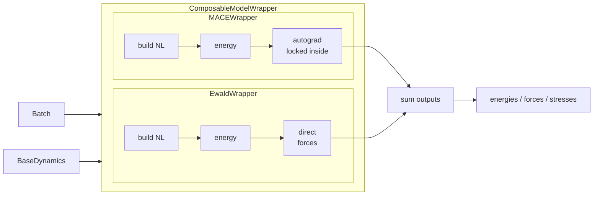
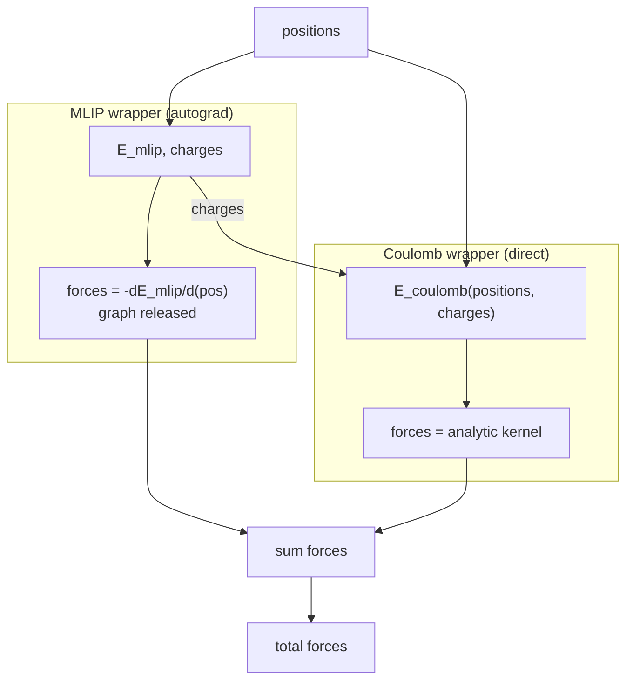
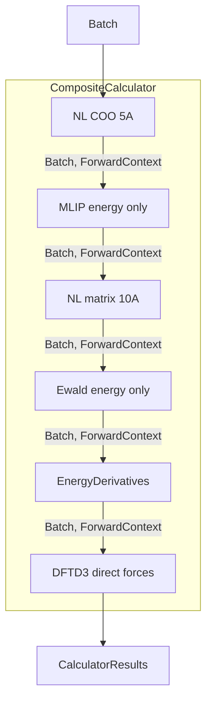
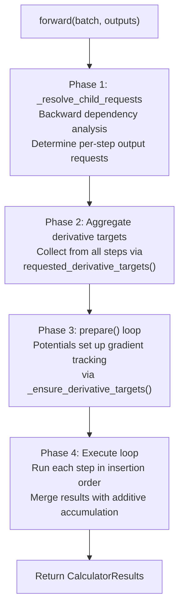

# Engineering Scoping Proposal: Replace `nvalchemi.models` with a composite calculator pipeline

**Author:** Roman Zubatyuk  
**Date:** 2026-03-30

---

## 1. Problem Statement

The previous `nvalchemi.models` architecture at commit `b4e8514509972dfda3493a91de433d63dcbd8d03` was centered on:

- `BaseModelMixin`
- `ModelConfig`
- `ModelCard`
- `ComposableModelWrapper`

That design treated composition mainly as wrapper composition. It combined capability metadata, execution behavior, and runtime output control inside one model object. This made the physical execution order difficult to express directly, especially for mixed pipelines where neighbor construction, ML short-range energy, long-range electrostatics, and differentiation should be staged explicitly.

The main design goal of this PR is to make the intended execution model first-class. The central flow is now naturally expressed as:

`NL -> MLIP -> NL -> Coulomb -> AutoGrad`

This is a better fit for:

- explicit ordered execution
- explicit force/stress derivation
- mixed ML + physical pipelines
- reuse of neighbor and reciprocal state
- future extension toward training with losses involving energies, forces, and stresses

## 2. Proposed Solution

Replace the previous wrapper-oriented `nvalchemi.models` surface with a calculator pipeline made of explicit steps:

- `CompositeCalculator` as the ordered runtime
- `Potential` as the base class for energy/direct-output steps
- `NeighborListBuilder` as an explicit neighbor-building step
- `EnergyDerivativesStep` as explicit autograd staging
- contract, metadata, results, and registry modules as supporting infrastructure

Built-in calculators such as `MACEPotential`, `AIMNet2Potential`, `DFTD3Potential`, `DSFCoulombPotential`, `EwaldCoulombPotential`, `PMEPotential`, and `LennardJonesPotential` are then assembled into one ordered pipeline instead of being hidden behind one monolithic wrapper hierarchy. Two MLIP wrappers are implemented: `MACEPotential` and `AIMNet2Potential`. `AIMNet2Potential` produces partial atomic charges (`node_charges`), so it is used to demonstrate integration with Coulomb potentials (Ewald, PME, DSF) that require per-atom charges as input.

### Previous Design




Properties of the previous design:

- **Execution order was implicit inside wrapper internals.** Each wrapper ran its own `forward()` as a monolithic call: neighbor list consumption, energy computation, and (for autograd-based models) differentiation were all baked into one method. `ComposableModelWrapper.forward()` looped over `self.models` left-to-right and summed `_COMPOSABLE_KEYS` (`energies`, `forces`, `stresses`); non-additive outputs were written to the batch on a last-write-wins basis. The user had no way to inspect, reorder, or insert steps between these internal stages.
- **Autograd vs direct derivatives were wrapper-level behavior.** Each wrapper declared `forces_via_autograd` in its `ModelCard`. Autograd wrappers (e.g. `MACEWrapper`) called `torch.autograd.grad` inside their own `forward()`; direct-force wrappers (Ewald, PME, DFTD3, LJ, DSF) computed forces analytically. This decision was frozen at wrapper construction time and invisible to the composition layer.
- **Neighbor handling was tied to wrapper metadata and dynamics hooks; dynamics depended directly on `BaseModelMixin` -- questionable separation of duties.** `BaseModelMixin.make_neighbor_hooks()` returned `[NeighborListHook(nc)]` derived from the model's `model_card.neighbor_config`, meaning the model dictated how dynamics should build neighbors. Conversely, `BaseDynamics.__init__()` required `isinstance(model, BaseModelMixin)` and read `model_card.forces_via_autograd` and `model_card.neighbor_config` directly. Dynamics was forced to know about model internals, and models were forced to know about dynamics hooks (`from nvalchemi.dynamics.hooks import NeighborListHook`). This circular dependency made it impossible to use the model layer without the dynamics layer or vice versa.

### Why the previous design could not scale to mixed pipelines

#### Autograd composition was blocked

`ComposableModelWrapper` explicitly rejected composing two autograd-forces models:

```python
if n_autograd > 1:
    raise NotImplementedError(
        "Composing two or more autograd-forces models is not yet supported. "
        "Energy-first composition (sum energies, single autograd pass) is "
        "required for memory correctness but not yet implemented."
    )
```

In practice this meant only one autograd MLIP (with `forces_via_autograd=True`) could be composed with any number of direct-force models (Ewald, PME, DFTD3, LJ, DSF all had `forces_via_autograd=False`). Each wrapper ran its own `forward()` including autograd internally. When the MLIP also produces charges consumed by a downstream Coulomb potential, the data flow looks like:




If both the MLIP and Coulomb wrappers were autograd-based, the second wrapper would receive a positions tensor whose autograd graph was already consumed by the first differentiation. The gradient would be either wrong or would raise a runtime error. More importantly, if the MLIP produces forces that depend on positions, the full computation graph from positions through all energy terms must remain intact for training losses (e.g. force-matching). Per-wrapper autograd breaks this graph.

Additionally, charges produced by the MLIP depend on positions. Differentiating `E_coulomb` w.r.t. positions requires the chain rule through `charges(positions)` -- i.e. `d(E_coulomb)/d(pos)` includes `d(E_coulomb)/d(charges) * d(charges)/d(pos)`. Per-wrapper autograd breaks this because the MLIP's graph (which contains `d(charges)/d(pos)`) is released after the MLIP's own differentiation pass. The Coulomb wrapper's analytic kernel only differentiates w.r.t. explicit position inputs, missing the indirect charge dependency entirely.

Resolving this limitation inside the old architecture would require:

- moving autograd out of individual wrappers into a single post-composition pass,
- introducing shared gradient tracking on positions -- a single `requires_grad_(True)` call before all wrappers run, 
- changing each autograd-based wrapper to return only energy (not forces) so the computation graph remains intact, 
- adding a new orchestration layer that controls execution order and decides when to differentiate.

This is essentially what the new design does with `EnergyDerivativesStep` -- the old architecture would need to be rebuilt around the same principles.

#### Neighbor lists: one list at max cutoff

`ComposableModelWrapper._build_model_card()` synthesized a single `NeighborConfig` from all children using the maximum cutoff and the most general format:

```python
max_cutoff = max(nc.cutoff for nc in sub_configs)
has_matrix = any(nc.format == NeighborListFormat.MATRIX for nc in sub_configs)
chosen_format = NeighborListFormat.MATRIX if has_matrix else NeighborListFormat.COO
```

One `NeighborListHook` at the max cutoff (R) served the whole composite. This is insanely inefficient when the pipeline includes both a short-range MLIP and a long-range  potential size local MLIPs are O(R^3). 

Although `make_neighbor_hooks()` returns a **list**, `ComposableModelWrapper._build_model_card()` synthesized a single `NeighborConfig` from all children (max cutoff, most general format), so `make_neighbor_hooks()` always returned exactly one hook. To support per-step neighbor lists, the composite would need to: (a) stop synthesizing a single config, (b) return one hook per child, (c) track which neighbor list belongs to which wrapper -- which breaks the "one `NeighborListHook` serves all" model and requires the kind of ordered orchestration the new design provides.

#### k-vector caching was per-wrapper

Both `EwaldModelWrapper` and `PMEModelWrapper` cached k-vectors, alpha, and cell as instance attributes (e.g. `self._cached_k_vectors`, `self._cached_alpha`). Invalidation was automatic on cell change (compared via `torch.allclose`, CUDA graph break) plus a manual `invalidate_cache()` method. While per-wrapper caching is functional, it means the **model** -- whose job is to compute energies and forces -- is also responsible for managing cache invalidation based on geometry changes (cell changes). This responsibility properly belongs to the dynamics layer or pipeline orchestrator, since it is dynamics that updates positions and cell. 

### What the new design must support

To fix these problems, the new architecture requires:

1. **Energy-only mode**: each potential produces energy without running autograd internally by default, so the total energy graph stays intact across all potentials. A `Potential` **can** run built-in autograd in its `compute()` if implemented to do so -- the architecture does not prohibit it -- but the default energy-only mode exists to keep the graph intact for the pipeline's `EnergyDerivativesStep`.
2. **Shared gradient-tracked positions**: a single `positions.requires_grad_(True)` tensor flows through all potentials, set up once during the `prepare()` phase.
3. **Explicit autograd placement**: the user places `EnergyDerivativesStep` in the pipeline and controls when `torch.autograd.grad` runs:
  - **Must run after** all potentials whose energy participates in the autograd graph (MLIP, Ewald, PME), so their contributions are included in the total derivative.
  - **Can run before** direct-output modules (DFTD3, LJ, DSF) that compute forces analytically. Running autograd earlier releases the graph sooner, reducing peak GPU memory. Direct forces are then additively merged into the final result.
4. **Per-step neighbor lists**: each `NeighborListBuilder` step builds at the cutoff and format its consumer advertizes, avoiding the computational penalty. Each builder supports `reuse_if_available` (default `True`): when matching neighbor data is already present in accumulated results or batch attributes, the builder skips recomputation. This enables dynamics-controlled caching with using Dynamics hooks, separately for long and short range neighbor lists.
5. **Pipeline context for inter-step data passing**: steps **can pass arbitrary data to each other** through the shared `CalculatorResults` accumulator. Each step's `compute()` returns a `CalculatorResults` (a `MutableMapping[str, Any]`), which the composite merges into a shared working container. Downstream steps read upstream data via `require_input(batch, key, ctx)` or `optional_input(batch, key, ctx)`, which resolves in order: `runtime_state.input_overrides` -> `ctx.results` -> `batch` attributes. Keys must be declared in the step's profile (`required_inputs` / `optional_inputs`) for validation. Additive keys (e.g. `energies`) are summed across producers; non-additive keys use last-write-wins.
  Concrete data flows through the pipeline context include: `node_charges` (AIMNet2 -> Coulomb potentials), `k_vectors` / `k_squared` (Ewald/PME -> reuse by downstream steps), and `neighbor_lists.<name>.`* (NeighborListBuilder -> consuming potentials). Both `EwaldCoulombPotential` and `PMEPotential` support `reuse_if_available` for reciprocal-space tensors, but **refuse cached k-vectors when stress or cell-derivative paths are active** because k-vectors depend on cell geometry and must be recomputed under autograd to produce correct stress gradients.

### New Design




Properties of the new design:

- execution order is explicit -- steps run in insertion order
- potentials produce only energy; differentiation is a separate step the user places
- neighbor building is explicit -- each builder uses the cutoff and format its consumer needs
- running autograd earlier releases the graph sooner, reducing peak GPU memory; direct forces are additively merged after
- reuse flows through named results (e.g. `k_vectors` shared across potentials)
- dynamics consumes a callable calculator surface instead of requiring `BaseModelMixin` inheritance

### Main Intended Pipelines

MLIP + long-range electrostatics (Ewald/PME use matrix format, MLIP uses COO):

```text
NeighborListBuilder (COO, ~5 A)
  -> MLIPPotential (e.g. MACEPotential)
  -> NeighborListBuilder (matrix, ~10 A)
  -> EwaldCoulombPotential / PMEPotential
  -> EnergyDerivativesStep
  -> DFTD3Potential (direct forces, runs after graph released)
```

AIMNet2 manages neighbors internally (`neighbor_requirement.source="internal"`) and produces partial atomic charges (`node_charges`) needed by Coulomb steps, so no external builder is needed for the MLIP step:

```text
AIMNet2Potential (produces node_charges for Coulomb)
  -> NeighborListBuilder (matrix, ~10 A)
  -> EwaldCoulombPotential / PMEPotential
  -> EnergyDerivativesStep
  -> DFTD3Potential (direct forces)
```

DSF supports both COO and matrix neighbor list formats (configurable via `DSFCoulombPotentialConfig.format`, default `"coo"`). Matrix format can be used to build a CUDA-graph-compatible pipeline:

```text
NeighborListBuilder (COO, ~5 A)
  -> MLIPPotential
  -> NeighborListBuilder (COO or matrix, ~10 A)
  -> DSFCoulombPotential (direct forces and stresses)
  -> EnergyDerivativesStep
```

## 3. Scope

### In Scope

- Replace the old `nvalchemi.models` public surface with the composite calculator API.
- Introduce the current step runtime already present in this PR:
  - `CompositeCalculator`
  - `Potential`
  - `NeighborListBuilder`
  - `EnergyDerivativesStep`
  - contracts / metadata / results / registry
- Port the built-in model and physical calculators already present in this PR.
- Retarget dynamics to calculator-style model callables instead of `BaseModelMixin`.
- Replace the main public docs entrypoints with the new model story.
- Re-baseline the model and relevant dynamics tests around the new architecture.
- Enable, by design, training flows where force and stress losses can be taken from explicit differentiated energy paths.

### Out of Scope

- Standardized embedding outputs in the public composite contract.
- Backward compatibility with the previous wrapper API.
- New functionality not already in this branch.
- A general planner-level derivative provenance system across all step types.

Notes:

- The current design intentionally leaves derivative correctness to the step author. A `Potential` decides which tensors remain attached to autograd. `CompositeCalculator` differentiates accumulated energy if the graph is present. Each calculator must avoid double counting between direct outputs and autograd-participating energy.
- Training is in scope only as an architectural capability enabled by the explicit differentiation model, not as a separate end-to-end training workflow added by this PR.

## 4. Design

### Architecture

The new runtime is organized around ordered calculation steps.

- `nvalchemi.models.base`
  - defines `_CalculationStep`, `Potential`, `ForwardContext`, and runtime derivative state
- `nvalchemi.models.composite`
  - defines `CompositeCalculator`
- `nvalchemi.models.autograd`
  - defines `EnergyDerivativesStep`
- `nvalchemi.models.neighbors`
  - defines `NeighborListBuilder` and builder configs
- `nvalchemi.models.contracts`
  - defines the two-layer contract system: class-level cards (`StepCard`, `PotentialCard`, `MLIPPotentialCard`, `NeighborListCard`) and their instance-level profiles (`StepProfile`, `PotentialProfile`, `NeighborListProfile`), plus `NeighborRequirement` and the assembled `PipelineContract`. `MLIPPotentialCard` pre-sets `gradient_setup_targets={"positions", "cell_scaling"}` for potentials that participate in the split-gradient architecture.
- `nvalchemi.models.results`
  - defines `CalculatorResults`
- `nvalchemi.models.registry`
  - defines local artifact registration and resolution

Execution inside `CompositeCalculator.forward()` proceeds in four phases:




1. **Resolve child requests**: walk steps backward to determine which steps need to run and what outputs each must produce. Additive keys (e.g. `energies`) are expanded so every producer contributes.
2. **Aggregate derivative targets**: collect `requested_derivative_targets()` from all steps (e.g. `EnergyDerivativesStep` requests `{"positions", "cell_scaling"}`).
3. **Prepare**: call `prepare()` on participating steps. Potentials with `gradient_setup_targets` set up `positions.requires_grad_(True)` and optional stress scaling on the shared `RuntimeState`.
4. **Execute**: run each step in insertion order, passing the shared `CalculatorResults` accumulator. Per-step results are merged using additive merge rules from each step's profile.

This is a direct replacement for the previous wrapper-first composition model in `ComposableModelWrapper`.

### API / Interface Sketch

#### Assembling a pipeline

A MACE + DFTD3 pipeline with explicitly constructed neighbor lists. The `neighbor_list_name` on the potential must match the name on its corresponding `NeighborListBuilder`:

```python
from nvalchemi.models import (
    MACEPotential, DFTD3Potential,
    NeighborListBuilder, EnergyDerivativesStep, CompositeCalculator,
)

mace = MACEPotential("mace-mp-0b3-medium", neighbor_list_name="mace")
mace_nl = NeighborListBuilder(
    cutoff=5.0, format="coo", neighbor_list_name="mace",
)

dftd3 = DFTD3Potential(neighbor_list_name="dftd3")
dftd3_nl = NeighborListBuilder(
    cutoff=15.0, format="matrix", neighbor_list_name="dftd3",
)

grad = EnergyDerivativesStep()

calculator = CompositeCalculator(
    mace_nl, mace, dftd3_nl, dftd3, grad,
    outputs={"energies", "forces", "stresses"},
)

results = calculator(batch, outputs={"energies", "forces"})
```

MACE uses COO format (its cutoff comes from the model's `r_max` attribute). DFTD3 uses matrix format at 15 A. Each potential and its neighbor list builder share a name (`"mace"`, `"dftd3"`) so the potential reads the correct neighbor data from the pipeline context. `EnergyDerivativesStep` runs after both potentials, differentiating the accumulated energy to produce forces and stresses.

`CompositeCalculator.__init__` takes `*steps: _CalculationStep` and an optional `outputs` default set. `forward()` accepts `batch`, optional `results` (pre-seeded `CalculatorResults`), and optional `outputs` override.

#### NeighborListBuilder

Each potential can emit a `NeighborListBuilderConfig` matching its advertised neighbor requirement via `neighbor_list_builder_config()`. The config inherits `cutoff`, `format`, and `neighbor_list_name` from the potential's `NeighborRequirement`, so the name agreement is automatic:

```python
mace = MACEPotential("mace-mp-0b3-medium", neighbor_list_name="mace")
dftd3 = DFTD3Potential(cutoff=12.0, neighbor_list_name="dftd3")

mace_nl = NeighborListBuilder(mace.neighbor_list_builder_config())
dftd3_nl = NeighborListBuilder(dftd3.neighbor_list_builder_config())
```

Direct construction is also supported for full control:

```python
nl = NeighborListBuilder(
    cutoff=5.0,
    format="coo",
    reuse_if_available=True,
    neighbor_list_name="default",
)
```

Parameters: `cutoff`, `format` (`"coo"` | `"matrix"`), `half_list`, `trim_matrix_to_fit`, `reuse_if_available` (default `True`), `neighbor_list_name` (default `"default"`). A `NeighborListBuilderConfig` Pydantic model can also be passed directly.

#### EnergyDerivativesStep

```python
grad = EnergyDerivativesStep(name="energy_derivatives")
```

Takes only an optional `name`. Declares `required_inputs={"energies"}` and `result_keys={"forces", "stresses"}`. During execution it reads accumulated `energies` from the pipeline context and runs `torch.autograd.grad` against the gradient-tracked positions (and optionally `cell_scaling` for stresses).

#### Potential base class

Subclasses override `compute()` and return results via the `build_results` helper:

```python
class Potential(_CalculationStep):
    card: PotentialCard          # class-level contract
    model_card: ModelCard | None # checkpoint metadata

    def compute(self, batch: Batch, ctx: ForwardContext) -> CalculatorResults:
        energy = self._run_kernel(batch, ctx)
        return self.build_results(ctx, energies=energy)

    def neighbor_list_builder_config(
        self, **overrides: Any,
    ) -> NeighborListBuilderConfig | None: ...
```

`ForwardContext` is a per-call dataclass created by the base `forward()` method and passed to `compute()`. It carries three fields:

- `outputs: frozenset[str]` -- the resolved set of output keys this step must produce on this call.
- `results: CalculatorResults | None` -- accumulated results from earlier pipeline steps. Steps read upstream data (neighbor lists, charges, k-vectors) via `self.require_input(batch, key, ctx)` or `self.optional_input(batch, key, ctx)`, which resolve against `ctx.results`, then fall back to `batch` attributes.
- `runtime_state: RuntimeState | None` -- shared derivative-tracking state injected by the composite, including `requested_derivative_targets` and `input_overrides` (e.g. gradient-tracked positions).

`build_results(ctx, **values)` filters to only the keys in `ctx.outputs` and drops `None` values. Constructor takes `name`, `device`, and `**profile_overrides` forwarded to the class-level `card.to_profile()`.

#### Artifact registry

```python
from nvalchemi.models.registry import (
    KnownArtifactEntry, register_known_artifact,
    resolve_known_artifact, list_known_artifacts,
)

register_known_artifact(
    KnownArtifactEntry(
        name="my-mace-finetuned",
        family="mace",
        url="https://example.com/my_model.pt",
        sha256="abcdef...",
        filename="my_model.pt",
        cache_subdir="mace",
        metadata={"model_name": "my-mace-finetuned"},
    )
)

artifact = resolve_known_artifact("my-mace-finetuned", family="mace")
mace = MACEPotential(artifact.local_path)

names = list_known_artifacts("mace")
```

`KnownArtifactEntry` is a frozen dataclass with `name`, `family`, optional `aliases`, `url`, `sha256`/`md5` for integrity, `cache_subdir`, `filename`, and `metadata`. `resolve_known_artifact` downloads (if needed), verifies the digest, and returns a `ResolvedArtifact` with the `local_path` and `checkpoint` provenance.

#### Dynamics integration boundary

```python
class DynamicsCalculator(Protocol):
    model_card: ModelCard | None

    def __call__(
        self,
        batch: Batch,
        *,
        outputs: Iterable[str] | None = None,
    ) -> ModelOutputs: ...
```

`BaseDynamics` consumes any callable matching this protocol, removing the previous `isinstance(model, BaseModelMixin)` requirement.

### Old vs New Comparison


| Area | Previous (`b4e8514`) | Current PR |
| --- | --- | --- |
| Public API | Lazy-exported wrappers (`MACEWrapper`, `PMEModelWrapper`, `ComposableModelWrapper`) | Explicit step classes (`MACEPotential`, `EwaldCoulombPotential`, ...) composed in `CompositeCalculator` |
| Execution model | `ComposableModelWrapper.forward()` loops over child wrappers and sums additive keys; each wrapper runs NL + energy + autograd internally | `CompositeCalculator.forward()` runs steps in insertion order; each step does one thing (build NL, compute energy, or differentiate) |
| Force/stress derivation | Per-wrapper: autograd wrappers call `torch.autograd.grad` inside their `forward()`; direct-force wrappers return forces from kernels; controlled by `ModelCard.forces_via_autograd` flag | Separate step: `EnergyDerivativesStep` differentiates accumulated energy; potentials return energy only by default; direct-force potentials merge additively after |
| Neighbor handling | `ComposableModelWrapper` synthesizes one `NeighborConfig` at max cutoff; `make_neighbor_hooks()` returns one `NeighborListHook`; dynamics calls the hook | Each `NeighborListBuilder` step builds at its own cutoff and format; potentials declare `NeighborRequirement` and match by `neighbor_list_name`; `reuse_if_available` caching |
| Registry / artifacts | Model names and aliases tied to wrapper class hierarchy | `KnownArtifactEntry` dataclass with explicit `name`, `family`, `url`, `sha256`; `register_known_artifact` / `resolve_known_artifact` |
| Dynamics integration | `BaseDynamics.__init__` requires `isinstance(model, BaseModelMixin)`; reads `model_card.forces_via_autograd` and `neighbor_config` directly | `BaseDynamics` accepts any callable matching `DynamicsCalculator` protocol; no inheritance requirement |


### Key Design Decisions


| Decision | Choice | Rationale |
| --- | --- | --- |
| Core runtime | Explicit ordered steps replace `BaseModelMixin` composition | Execution order and data flow become explicit and configurable |
| Derivative staging | `EnergyDerivativesStep` replaces per-wrapper autograd | Makes force/stress provenance visible in the pipeline |
| Neighbor handling | Explicit `NeighborListBuilder` steps with `NeighborRequirement` contracts | Separates neighbor production from energy/force-producing steps |
| Contract system | Two-layer contracts: class-level cards declare static capabilities; instance-level profiles capture configured behavior | Separates what a step can do from how it is configured in a particular pipeline |
| Registry | Local `KnownArtifactEntry`-based registry | Provides a few example implementations; registry is extendable |
| Dynamics integration | Callable `DynamicsCalculator` protocol | Removes direct coupling between models and dynamics |
| Derivative provenance | Left to step authors rather than planner inference | Pipeline cannot infer which tensors should remain under autograd; step authors own derivative correctness |


## 5. Performance Considerations

### Per-forward overhead

Every `CompositeCalculator.forward()` call performs the following Python-side work before any GPU kernel runs:

1. `**_active_outputs()**` -- builds a `frozenset` from the requested outputs and validates it against `pipeline_contract.result_keys` (a set difference; the contract is cached at `__init__` time).
2. `**_validate_external_inputs()**` -- calls `_required_external_inputs()`, which internally calls `_resolve_child_requests()` (a backward pass over steps using set intersections). Then checks `hasattr(batch, key)` for each required key not already in the seeded results.
3. `**_resolve_child_requests()**` -- called a **second time** for the actual execution (identical computation, not cached between the validation and execution paths).
4. **Derivative target aggregation** -- loops over steps, collects `requested_derivative_targets()` from each into a union set, assigns to `RuntimeState`.
5. `**prepare()` loop** -- calls `step.prepare()` for each participating step. `Potential._ensure_derivative_targets` is idempotent and skips already-set targets.
6. **Execute loop** -- calls `step.forward()` -> `compute()` for each step, then `working.merge()` to accumulate results.

### What is cached at `__init__` time

- `pipeline_contract` -- aggregated `result_keys`, `additive_result_keys`, and step names (via `_assemble_contract()`)
- Step registration in `nn.ModuleDict`

### What is NOT cached (recomputed every forward)

- `_resolve_child_requests` runs twice per forward (validation + execution) -- pure Python set operations over the step list
- `RuntimeState` is freshly allocated each forward
- `CalculatorResults` working container is freshly allocated (or shallow-copied from seed)

### Reuse optimizations within steps

- `NeighborListBuilder` with `reuse_if_available=True` (default) skips neighbor list rebuild when matching data is already present in accumulated results or batch attributes.
- `EwaldCoulombPotential` and `PMEPotential` with `reuse_if_available=True` skip k-vector regeneration when cached tensors are present (except on stress/cell-derivative paths, where k-vectors must be recomputed under autograd).

This PR does not introduce a benchmark framework or new quantitative performance claims, so performance review should focus on architectural plausibility and reuse paths, not on benchmark deltas.

## 6. Risks & Open Questions

| Risk / Question                                                                                   | Impact                                                                                                                       | Mitigation / Next Step                                                                                                     |
| ------------------------------------------------------------------------------------------------- | ---------------------------------------------------------------------------------------------------------------------------- | -------------------------------------------------------------------------------------------------------------------------- |
| No enforced shape / dtype contract between stages                                                 | Step composition remains flexible but some mismatches are only caught at runtime inside step code                            | Keep docs explicit now; introduce sharper contract validation later if needed                                              |
| Derivative provenance is not encoded as a first-class planner contract                            | Correctness depends on the step author deciding which tensors stay attached to autograd and which direct outputs are emitted | Document this boundary clearly in design/docs; only revisit planner-level provenance if more hybrid step types appear      |
| DSF hybrid behavior is implementation-level rather than contract-level                            | Reviewers may expect planner-level provenance semantics that are not present                                                 | Document DSF explicitly as intentional hybrid behavior; do not redesign it in this PR                                      |
| `docs/model_card_ext.py` still contains hardcoded family lookup logic in `foundation-model-table` | Docs generation is less generic than the runtime registry                                                                    | Accept for now; treat as docs follow-up                                                                                    |
| Dynamics validation is intentionally loose (`callable` + optional `model_card`)                   | Runtime checks do not fully validate model semantics                                                                         | Accept as part of decoupling from `BaseModelMixin`; strengthen only if dynamics starts depending on more explicit behavior |
| Documentation carries part of the semantic burden                                                 | Reviewers must read docs to understand execution semantics and intended usage                                                | Include this design note in the PR and direct reviewers to start here                                                      |

