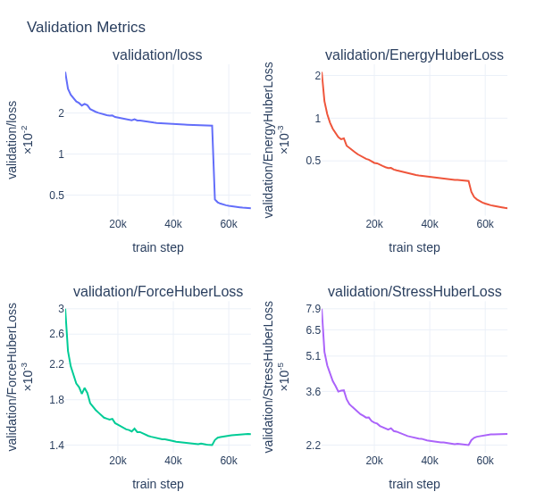

<!-- markdownlint-disable MD014 -->

(mace_training_example)=

# MACE Training Example

This guide walks through a complete model-training lifecycle using the ALCHEMI Toolkit. To anchor these concepts in a realistic workflow, we build and train a vanilla ScaleShiftMACE model on the MatPES r2SCAN dataset.

The code snippets below highlight core **nvalchemi** APIs — data pipes, model wrappers, loss composition, hooks, validation config, optimizer config, and {py:class}`~nvalchemi.training.TrainingStrategy`. The runnable end-to-end recipe that wires these pieces together with Hydra is
[`examples/advanced/10_mace_training.py`](../../examples/advanced/10_mace_training.py); its default config is
[`examples/advanced/10_vanilla_mace.yaml`](../../examples/advanced/10_vanilla_mace.yaml).

The ALCHEMI training workflow has the following structure:

```text
[Graph Data] ➔ [Model Architecture] ➔ [Supervised Objective] ➔ [Runtime Hooks] ➔ [Training Strategy]
```

## 1. Data: MatPES r2SCAN Dataset

This pipeline reads MatPES r2SCAN structures from ALCHEMI-compatible Zarr splits.

Each sample contains the graph inputs needed by the model: atomic positions,
atom types, periodic boundary condition metadata, and supervised labels such as
energy, forces, and stresses.

## 2. Model: Vanilla MACE

The default configuration trains a 3.87M-parameter ScaleShiftMACE model from
[ACEsuit](https://github.com/acesuit/mace) with energy, force, and stress
outputs. In nvalchemi, the model is wrapped with {py:class}`~nvalchemi.models.mace.MACEWrapper` and can plug into
`TrainingStrategy`.

It also uses NVIDIA cuEquivariance kernels by default (`model.cueq.enabled: true` and `model.cueq.optimize_all: true` in the Hydra config).

## 3. Build the Data Pipelines

Next, we construct the executable pipeline that streams data from disk into batched tensors.

{py:class}`~nvalchemi.data.datapipes.AtomicDataZarrReader` streams raw Zarr
samples, and {py:class}`~nvalchemi.data.datapipes.DataLoader` compiles individual
graphs into batched {py:class}`~nvalchemi.data.Batch` objects ready for the
model:

```python
from pathlib import Path

import torch
from nvalchemi.data.datapipes import AtomicDataZarrReader, DataLoader, Dataset

device = torch.device("cuda" if torch.cuda.is_available() else "cpu")

train_dataset = Dataset(
    AtomicDataZarrReader(Path("/path/to/r2scan-2025.2-train.zarr")),
    device=device,
)
train_batches = DataLoader(
    train_dataset,
    batch_size=32,
    shuffle=True,
)

val_dataset = Dataset(
    AtomicDataZarrReader(Path("/path/to/r2scan-2025.2-valid.zarr")),
    device=device,
)
val_batches = DataLoader(val_dataset, batch_size=64, shuffle=False)
```

The default config uses a per-process training batch size of 32 and a validation
batch size of 64. Structure sizes in this dataset can run up to 240 atoms, so an
unlucky draw of larger graphs can still spike memory. When memory is tighter or
the size distribution is heavier-tailed, {py:class}`nvalchemi.data.datapipes.SizeAwareBatchSampler`
is a useful alternative: it limits atom count in a batch so each batch stays
within a chosen memory budget.

### Infer model metadata from the dataset

Before building the model, populate dataset-derived metadata in your Hydra config:
`E0s` (from structure-energy regression or isolated-atom
DFT), `avg_num_neighbors`, and the ScaleShiftMACE pair `atomic_inter_shift` /
`atomic_inter_scale`. The default YAML includes values precomputed from the
training split. Supply equivalent values from your own preprocessing when
training on a different dataset.

## 4. Defining the Multi-Objective Loss

The default recipe fits energies, forces, and stresses. The loss function is a weighted sum of the individual Huber losses constructed using the `+` and `*` operators to form the {py:class}`~nvalchemi.training.ComposedLossFunction` instance.

```python
from nvalchemi.training import (
    ComposedLossFunction,
    EnergyHuberLoss,
    ForceHuberLoss,
    PiecewiseWeight,
    StressHuberLoss,
)

stage_two_start = 54400  # training.loss.stage_two.start_step
loss_fn: ComposedLossFunction = (
    PiecewiseWeight(boundaries=(stage_two_start,), values=(1.0, 10.0), per_epoch=False)
    * EnergyHuberLoss(per_atom=True, delta=0.01)
    + PiecewiseWeight(boundaries=(stage_two_start,), values=(10.0, 1.0), per_epoch=False)
    * ForceHuberLoss(delta=0.01)
    + PiecewiseWeight(boundaries=(stage_two_start,), values=(100.0, 10.0), per_epoch=False)
    * StressHuberLoss(delta=0.01)
)
loss_fn.normalize_weights = False
```

In this case, stage-one weights hold until `stage_two_start`, then switch to stage-two values
(`1/10/100` → `10/1/10` at step 54,400 of 68,000).

## 5. Assembling the TrainingStrategy

With data loaders, a wrapped model, and a loss defined, unify them inside
{py:class}`~nvalchemi.training.TrainingStrategy`. This orchestration object
governs the model execution graph, backpropagation, optimizer states, validation,
and runtime hooks.

```python
import torch
from mace.modules import ScaleShiftMACE

from nvalchemi.models.mace import MACEWrapper

# Construct ScaleShiftMACE with dataset-derived metadata, then wrap it.
mace_model = ScaleShiftMACE(...)
model = MACEWrapper(mace_model.to(device=device, dtype=torch.float32))
model.model_config.active_outputs = {"energy", "forces", "stress"}
```

Any object passed to `TrainingStrategy` must follow
{py:class}`~nvalchemi.models.base.BaseModelMixin`. `MACEWrapper` handles input
adaptation, neighbor-list metadata, and output routing for MACE variants.

### Harnessing Runtime Hooks

Hooks extend the core training loop without cluttering it. For example, {py:class}`~nvalchemi.hooks.NeighborListHook` rebuilds the atomic interaction graph immediately before every forward pass, and {py:class}`~nvalchemi.training.CheckpointHook` saves restartable checkpoints on a step cadence:

```python
from nvalchemi.distributed import DistributedManager
from nvalchemi.hooks import NeighborListHook
from nvalchemi.training import (
    CheckpointHook,
    DDPHook,
    EMAHook,
    OptimizerConfig,
    TrainingStage,
    TrainingStrategy,
    ValidationConfig,
    default_training_fn,
)

DistributedManager.initialize()
manager = DistributedManager()

strategy = TrainingStrategy(
    models=model,
    optimizer_configs=OptimizerConfig(
        optimizer_cls=torch.optim.AdamW,
        optimizer_kwargs={"lr": 5.0e-3, "weight_decay": 1.0e-3},
        scheduler_cls=torch.optim.lr_scheduler.CosineAnnealingLR,
        scheduler_kwargs={"T_max": 54400, "eta_min": 1.0e-3},
    ),
    num_steps=68_000,
    training_fn=default_training_fn,
    loss_fn=loss_fn,
    devices=[torch.device(manager.device)],
    distributed_manager=manager,
    hooks=[
        DDPHook(backend="nccl", sampler_kwargs={"seed": 42}),
        EMAHook(decay=0.995),
        NeighborListHook(
            model.model_config.neighbor_config,
            max_neighbors=256,
            stage=TrainingStage.BEFORE_FORWARD,
        ),
        CheckpointHook(checkpoint_dir="outputs/checkpoints", step_interval=10000),
    ],
    validation_config=ValidationConfig(
        validation_data=val_batches,
        every_n_steps=1000,
    ),
)
strategy.run(train_batches)
```

Runtime behavior such as distributed wrapping, EMA, neighbor-list construction,
checkpointing, and logging is attached through hooks. Validation is initialized using
{py:class}`~nvalchemi.training.ValidationConfig`. In multi-GPU runs, validation uses a
`DistributedSampler` so each rank evaluates a disjoint shard of the validation set.

Schedulers are attached through {py:class}`~nvalchemi.training.OptimizerConfig`.
The snippet above uses PyTorch's `CosineAnnealingLR` for the first training
stage; the runnable example holds the learning rate constant after that stage.
Any `torch.optim.lr_scheduler.LRScheduler` subclass can be passed via
`scheduler_cls` and `scheduler_kwargs`.

## 6. Configuring and Launching Training Runs

The runnable example uses the Hydra config. The default config is
[`examples/advanced/10_vanilla_mace.yaml`](../../examples/advanced/10_vanilla_mace.yaml).

For distributed training with data parallelism, launch on a node with torchrun to leverage the `DDPHook` that wraps the model in DDP at `TrainingStage.BEFORE_TRAINING`:

```bash
uv run torchrun --standalone --nproc_per_node=8 \
    examples/advanced/10_mace_training.py \
    --config-name=10_vanilla_mace \
    training.steps=10000
```

In a distributed configuration, `training.batch_size` is the size per GPU. The
global batch size is `training.batch_size * world_size`.

## 7. Monitoring Validation During Training

We evaluate held-out batches according to `ValidationConfig`. The validation result is reported based on
the cadence from `training.validation.every_steps`. Values are averaged over the validation batches.

Training the default vanilla MACE recipe on MatPES r2SCAN (~78k optimizer
steps, ~50 epochs) yields the validation curve below.



Held-out test MAEs are energy 27.2 meV/atom, forces 147 meV/Å, and stress
0.749 GPa, comparable to the MatPES r2SCAN benchmarks in
[the MatPES paper](https://arxiv.org/pdf/2503.04070) and training with the
[MACE CLI](https://github.com/ACEsuit/mace). Longer runs (~200k steps) typically
improve accuracy further.


## See Also

- {ref}`training_guide` — training lifecycle, hooks, and validation.
- {ref}`losses_guide` — composing losses and weight schedules.
- [`examples/advanced/10_mace_training.py`](../../examples/advanced/10_mace_training.py)
  for the runnable Hydra entrypoint.
- [`examples/advanced/10_vanilla_mace.yaml`](../../examples/advanced/10_vanilla_mace.yaml)
  for the default config.
